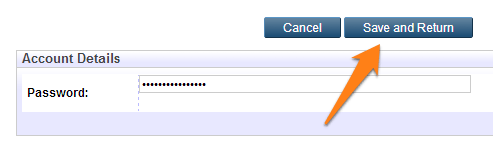

Your NECTAR account is not linked to your university login - you'll need to set your own password. You can change your password at any time.

1. Click the **Profile** link in the top menu:

2. On the Profile page, click the **Edit** button:

3. Enter your new password and click **Save and Return**:

Your new password is now set.

[^Top](#header)